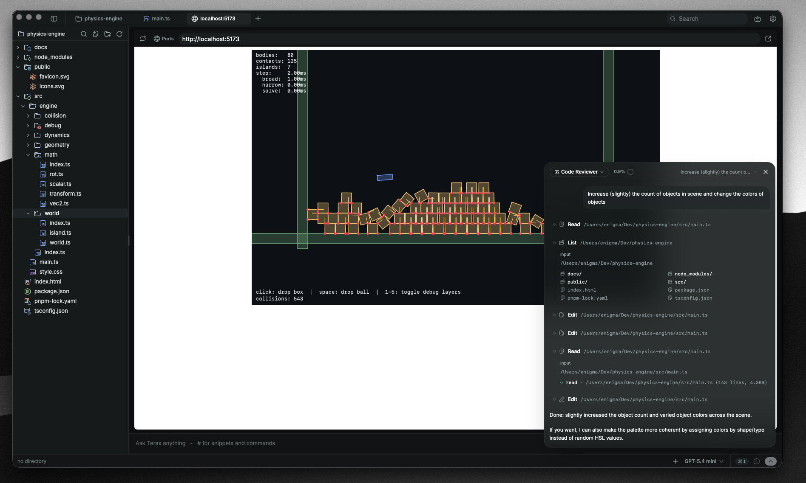
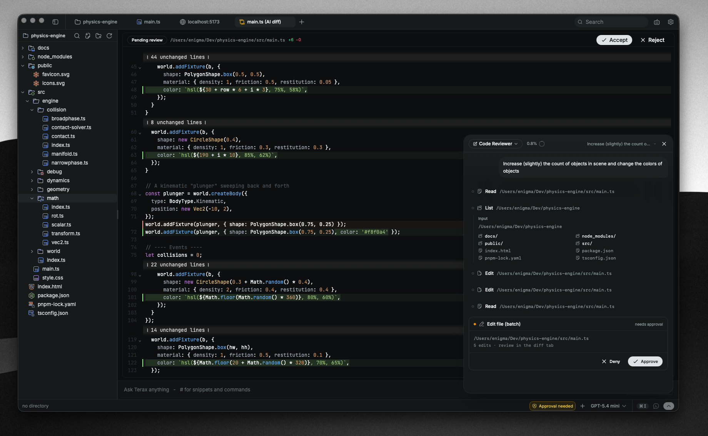

<div align="center">
  

  <p><em>The AI-native terminal emulator.</em></p>

  <p>
    <a href="#features"></a>
    <a href="LICENSE"></a>
    <a href="#build-from-source"></a>
  </p>
</div>

<br />

Kai is a fast, cross-platform terminal built on **Tauri 2 + Rust** and **React 19**. It combines a native PTY backend with a modern editor, file explorer, web preview, and a first-class AI assistant — all in under 10 MB, with zero telemetry and keys stored in the OS keychain.

<br />

<table>
  <tr>
    <td align="center"><br/><sub>Multi-tab terminal · WebGL rendering</sub></td>
    <td align="center"><br/><sub>Built-in web preview for local servers</sub></td>
  </tr>
  <tr>
    <td colspan="2" align="center"><br/><sub>AI agent workflow with inline edit diffs</sub></td>
  </tr>
</table>

<br />

---

## Features

### Terminal
- **xterm.js + WebGL** renderer with multi-tab, split panes, and background streaming
- Native PTY via `portable-pty` — bash, zsh, PowerShell, cmd
- Shell integration with cwd reporting and prompt markers
- Inline search, link detection, true-color support
- **Smart error detection** — auto-detects errors in terminal output and offers one-click "Ask Kai to fix"
- Workspace directory persisted across restarts

### Editor
- **CodeMirror 6** — TypeScript, JavaScript, Rust, Python, Go, HTML/CSS, JSON, Markdown, and more
- **Find & Replace** — with case-sensitive and regex toggles (`Ctrl+H`)
- **Inline AI autocomplete** — ghost-text completions powered by any configured provider
- AI-generated edit diffs with approval flow
- Seven built-in themes (Tokyo Night, Nord, GitHub, Atom One, Aura, Copilot, Xcode)
- Vim mode · Markdown preview

### File Explorer
- Catppuccin file icon theme
- Fuzzy search, keyboard navigation, inline rename
- "Open in Kai" shell context menu (Windows NSIS installer)

### Web Preview
- Auto-detects local dev servers and opens in-app
- Configurable proxy URL for non-local domains
- Links in agent output and terminal open in the built-in browser

### AI — bring your own key
- **Providers** — OpenAI, Anthropic, Google, Groq, xAI, Cerebras, DeepSeek, Mistral, OpenRouter, or any OpenAI-compatible endpoint
- **Local models** — LM Studio, Ollama, or any local inference server
- **MCP** — connect external tool servers via the Model Context Protocol (stdio, SSE, HTTP)
- **MCP Registry** — browse, search, and one-click install from the official registry
- **Skills** — reusable prompt + tool bundles invoked with `#handle`, optionally bound to MCP servers
- **@ Mentions** — type `@` in the composer to attach files from the workspace as context
- **Auto-approve** — three modes (off / edits / all) for uninterrupted agent runs
- **Context summarization** — automatically compresses long conversations so you never hit a context limit
- **Voice input** — dictate prompts via browser Speech API or OpenAI Whisper
- **Document reading** — PDF and DOCX parsing built in
- **Web browsing** — built-in `web_browse` and `web_search` tools
- **YouTube summarization** — paste a YouTube link and the agent fetches captions and summarizes the video
- Cancellable commands, edit diffs, multi-agent support, `KAI.md` project memory

### API Tester
- Built-in REST client — test any HTTP endpoint without leaving Kai
- Method selector, headers editor, body editor, response viewer with JSON pretty-print
- Color-coded status, response time, raw/pretty toggle

### Quality
- ~8 MB on disk
- API keys stored in the OS keychain — never touch disk
- No telemetry, no account required
- Line-ending-resilient edit tool — works correctly on Windows (`\r\n`) without edit loops

---

## Getting Started

### Configure AI

1. Open **Settings → AI**
2. Pick a provider and paste your API key — or point Kai at a local inference endpoint
3. Keys are written to the OS keychain via `keyring`

### Platform Notes

**Windows** — SmartScreen may warn on first launch (unsigned binary). Click *More info → Run anyway*.
Default shell is `cmd.exe`; change in **Settings → General → Shell**.

**Linux** — AppImage needs FUSE (`--appimage-extract-and-run` as fallback). On Wayland with rendering issues, try `WEBKIT_DISABLE_DMABUF_RENDERER=1` or use the `.deb` / `.rpm` packages.

---

## Build from Source

**Prerequisites**
- [Rust](https://rustup.rs) (stable)
- [Node 20+](https://nodejs.org) and [pnpm](https://pnpm.io)
- [Tauri prerequisites](https://tauri.app/start/prerequisites/) for your platform

```bash
pnpm install
pnpm tauri dev          # development
pnpm tauri build        # production bundle
```

```bash
pnpm exec tsc --noEmit          # type-check
cd src-tauri && cargo clippy    # lint
```

---

## Tech Stack

Tauri 2 · Rust · portable-pty · React 19 · TypeScript · xterm.js · CodeMirror 6 · Vercel AI SDK · Tailwind v4 · shadcn/ui · Zustand

## Contributing

Issues and PRs welcome. See [CONTRIBUTING.md](CONTRIBUTING.md) for guidelines.

## License

Apache-2.0 — see [LICENSE](LICENSE) and [NOTICE](NOTICE).
