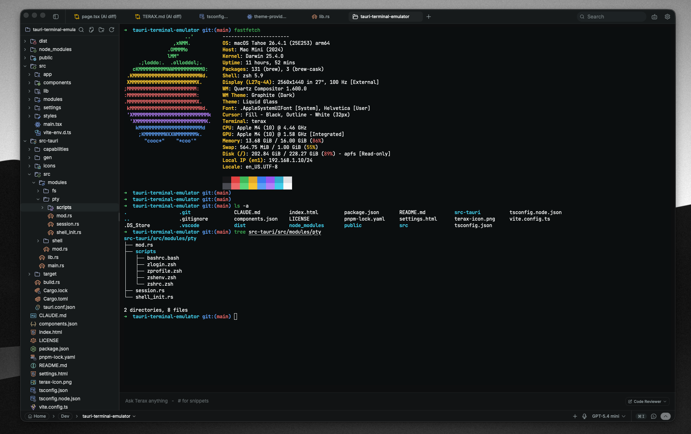
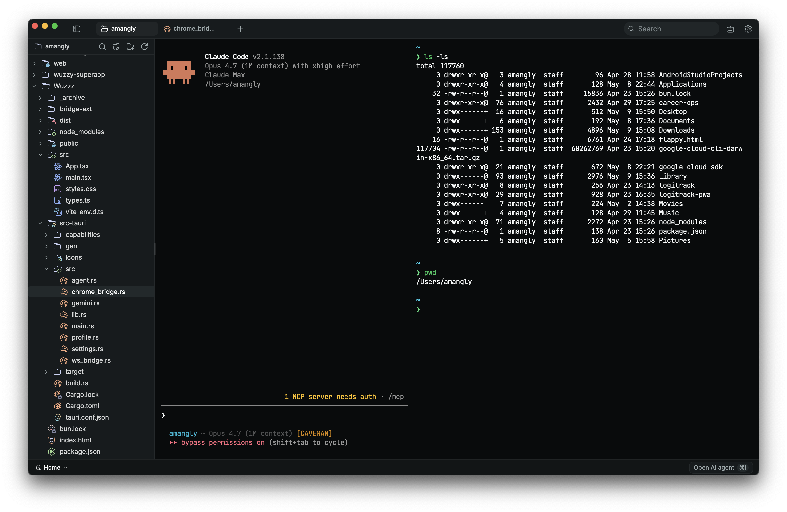

<div align="center">
  

  <p>Minimal, private AI-native terminal emulator</p>

  <p>
    <a href="https://github.com/Omodaka9375/kai/releases/latest"></a>
    <a href="LICENSE"></a>
    <a href="#build-from-source"></a>
  </p>
</div>

---

Kai is a fast, cross-platform terminal built on **Tauri 2 + Rust** and **React 19**. Terminal, code editor, file explorer, web preview, and AI agent — in one app, under 10 MB, zero telemetry.

<p align="center">
  
  
</p>

## Features

**Terminal** — xterm.js + WebGL, multi-tab, split panes, shell integration (bash/zsh/PowerShell/cmd), inline search, smart error detection with one-click AI fix, toroidal **Conway's Game of Life thinking spinner**, and **Escape-key streaming interrupt**.

**Editor** — CodeMirror 6 with 44 languages, find & replace, inline AI autocomplete, edit diffs with approval flow, 9 editor themes, Vim mode (with `:w`/`:q` Ex commands), image & PDF preview, and **Open in Live Preview** (right-click any HTML file to spawn a local background HTTP server and preview it instantly in-app).

**AI Agent** — bring your own key. Supports OpenAI, Anthropic, Google, Groq, xAI, Cerebras, DeepSeek, Mistral, OpenRouter, and direct Z.ai (GLM) integration. Supports **Clipboard Image Pasting (`Ctrl+V`)** to attach screenshots instantly, and **Interactive Todo Toggling** with auto-closing completion lists. Local models via LM Studio or Ollama.

**Image & Video Generation** — generate images and videos directly from chat. Image: OpenAI GPT Image 2, Google Nano Banana 2, xAI Grok Imagine, ComfyUI (local). Video: Kling 3.0, Google Veo 3.1, ByteDance Seedance 2.0, ComfyUI. Inline rendering with lightbox and download.

**MCP** — connect external tool servers via Model Context Protocol. Browse and install from the official registry.

**More** — file explorer with Catppuccin icons, built-in web preview (featuring a one-tap Stop button), REST API tester, 8 UI themes, voice input (Whisper), PDF/DOCX reading, **Direct PDF Export (`convert_to_pdf`)** to convert Markdown/Word directly to styled PDFs, YouTube transcript summarization, `Kai.md` project memory, context summarization, auto-approve modes.

## Agent Personas

KAI features highly specialized built-in agent personas designed to assist across every dimension of engineering. You can switch between them inside the chat pane, customize their prompts, and reset them to factory defaults at any time:

*   **Coder** 💻: General-purpose development. Resolves, refactors, and runs tests.
*   **Architect** 📐: restful restatements, tradeoffs, scalability, and multi-option blueprints.
*   **Code Reviewer** 🔍: Logic reviews, edge cases, race conditions, and performance cliffs.
*   **Security** 🛡️: Threat-modeling, input validation, and secure cryptographic defaults.
*   **Designer** 🎨: UI/UX critique, density, typography, spacing, and modern motion.
*   **Researcher** 🛰️: Web search, page browsing, and structured source citations.
*   **Assistant** ✍️: Creative brainstorming, copyediting, article summaries, and text tasks.

## Install

Grab the latest installer from [**Releases**](https://github.com/Omodaka9375/kai/releases/latest) — available for Windows (.exe), macOS (.dmg), and Linux (.deb / .rpm / .AppImage).

Auto-update is built in.

## Quick Start

1. Open **Settings → Models**
2. Add an API key for any provider — or point to a local model
3. Press `Ctrl+I` to open the AI agent

Keys are stored in the OS keychain. No account required.

## Configuration Guides

### 1. Offline Setup with LM Studio

KAI has full support for local, offline-only development. To use a local GGUF model:
1.  Open **LM Studio** and navigate to the **Developer** tab.
2.  Start the local HTTP server. Note the base URL (usually `http://localhost:1234/v1`).
3.  In KAI, open **Settings → Models** and enter the Base URL and the active **Model ID** (e.g. `qwen3.3-coder-instruct`). Click **Save**.
4.  You can now select **LM Studio (Local)** in your chat or autocomplete dropdown for 100% private intelligence.

### 2. One-Click MCP installations

Extend your AI agent's capabilities with custom tools via the Model Context Protocol:
1.  Open KAI's left sidebar and switch to the **Extensions** (puzzle icon) tab.
2.  Browse or search for official MCP servers (such as `Filesystem`, `PostgreSQL`, or `GitHub`).
3. Click **Install**. KAI will automatically download and connect the server in the background, making its tools immediately available to your active agent.

### 3. Project Memory with Kai.md
KAI allows you to define custom guidelines, development standards, architectural context, and preferred workflows for your AI agent on a per-project basis.
To activate this, manually create a file named `Kai.md` at your project's root directory. KAI will automatically read and inject its contents (up to 32KB) directly into the agent's core instruction prompt on every message.
*   **Case Sensitivity**: The filename must be exactly `Kai.md` on case-sensitive filesystems like Linux. On Windows/macOS, variations like `KAI.md` or `kai.md` are also recognized.
*   **Zero-Write Safe**: KAI only reads from this file; it will never modify or write to your `Kai.md` file during a session, keeping you in full control of your guidelines.
*   **What to Include**: Define your tech stack, formatting guidelines, database schemas, directory mappings, or preferred test commands.

## Build from Source

```bash
# Prerequisites: Rust (stable), Node 20+, pnpm, Tauri v2 deps
pnpm install
pnpm tauri dev          # development
pnpm tauri build        # production
```

## Tech Stack

Tauri 2 · Rust · React 19 · TypeScript · xterm.js · CodeMirror 6 · Vercel AI SDK · Tailwind v4 · shadcn/ui

## Contributing

Issues and PRs welcome.

## License

Apache-2.0 — see [LICENSE](LICENSE) and [NOTICE](NOTICE).
