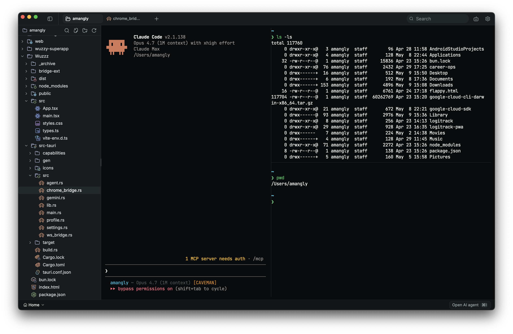

<div align="center">
  

  <p>Minimal, private AI-native terminal</p>

  <p>
    <a href="https://github.com/Omodaka9375/kai/releases/latest"></a>
    <a href="LICENSE"></a>
    <a href="#build-from-source"></a>
  </p>
</div>

---

Kai is a fast, cross-platform terminal built on **Tauri 2 + Rust** and **React 19**. Terminal, code editor, file explorer, web preview, and AI agent — in one app, lightweight, zero telemetry.

<p align="center">
  
  
</p>

## Contents

- [Features](#features) · [Agent Personas](#agent-personas) · [Install](#install) · [Quick Start](#quick-start) · [Configuration Guides](#configuration-guides) · [Build from Source](#build-from-source) · [Tech Stack](#tech-stack)

## Features

### Terminal

- xterm.js + WebGL rendering, multi-tab with split panes
- Shell integration for bash, zsh, PowerShell, and cmd
- Inline search, smart error detection, autocomplete
- Escape-key streaming interrupt, and a toroidal Conway's Game of Life thinking spinner

### Editor

- CodeMirror 6 with 44 languages and find & replace
- Side-by-side AI edit diffs with per-hunk approve/reject
- 9 themes, Vim mode (`:w` / `:q` Ex commands, visual/insert/normal)
- Image & PDF preview, plus **Open in Live Preview** — right-click an HTML file to serve and preview it in-app

### AI Agent

- **Bring your own key** — OpenAI, Anthropic, Google, Groq, xAI, Cerebras, DeepSeek, Mistral, OpenRouter, and direct Z.ai (GLM)
- Local models via LM Studio or Ollama
- Paste screenshots straight into chat with `Ctrl+V`
- Universal file extraction — zip, audio, image, and video read locally as text
- Interactive todo toggling with auto-closing completion lists
- Per-model thinking control — a toggle on each reasoning model cycles effort off/low/medium/high
- Multi-step goals with automation, plan mode (queue edits for review as one diff), and sub-agents (explore / code-review / security / research)
- Conversation forking and merging — branch any message into a parallel thread, then merge it back or into another thread

### Image & Video Generation

- Generate directly from chat, with inline rendering, lightbox, and download
- **Image:** OpenAI GPT Image 2 · Google Nano Banana 2 · xAI Grok Imagine · ComfyUI
- **Video:** Kling 3.0 · Google Veo 3.1 · ByteDance Seedance 2.0 · ComfyUI

### Git

- Stage, commit, push, and review diffs from the source-control panel
- Manage branches (list, switch, create, delete) without leaving the panel
- Resolve merge conflicts with conflict counts and per-file line locations, plus one-click "Ask KAI to resolve"
- Optional GPG commit signing (auto-sign or approval modes)

### Extensibility & Tooling

- **MCP** — connect external tool servers and install from the official registry
- File explorer and built-in web preview (with one-tap Stop)
- REST API tester and 8 UI themes
- Local Whisper voice transcription (offline, bundled Silero VAD)
- PDF/DOCX reading, image OCR (tesseract), ZIP/JAR listing, and audio metadata
- Direct PDF export (`convert_to_pdf`) from Markdown/Word
- YouTube transcript summarization
- `Kai.md` project memory, context summarization, and auto-approve modes
- Skills & snippets
- Per-project **sandbox** (read-only or workspace-only) and a **detached-copy** workflow — work in an isolated copy, then merge or discard

## Agent Personas

KAI ships highly specialized built-in agent personas for different kinds of work. Switch between them in the chat pane, customize their prompts, and reset to factory defaults at any time.

- **Coder** 💻 — general-purpose development: resolves, refactors, and runs tests
- **Architect** 📐 — tradeoffs, scalability, and multi-option blueprints
- **Code Reviewer** 🔍 — logic, edge cases, race conditions, and performance cliffs
- **Security** 🛡️ — threat modeling, input validation, and secure crypto defaults
- **Designer** 🎨 — UI/UX critique, density, typography, spacing, and modern motion
- **Researcher** 🛰️ — web search, page browsing, and structured citations
- **Assistant** ✍️ — brainstorming, copyediting, summaries, and text tasks

## Install

Grab the latest installer from [**Releases**](https://github.com/Omodaka9375/kai/releases/latest) — available for Windows (.exe), macOS (.dmg), and Linux (.deb / .rpm / .AppImage).

Auto-update is built in.

## Quick Start

1. Open **Settings → Models**
2. Add an API key for any provider — or point to a local model
3. Press `Ctrl+I` to open the AI agent

Keys are stored in the OS keychain. No account required.

## Configuration Guides

### 1. Offline Setup with LM Studio

KAI has full support for local, offline-only development. To use a local GGUF model:

1. Open **LM Studio** and go to the **Developer** tab.
2. Start the local HTTP server and note the base URL (usually `http://localhost:1234/v1`).
3. In KAI, open **Settings → Models** and enter the base URL and active **Model ID** (e.g. `qwen3.3-coder-instruct`). Click **Save**.
4. Select **LM Studio (Local)** in chat for fully private intelligence.

### 2. One-Click MCP installations

Extend your AI agent's capabilities with custom tools via the Model Context Protocol:

1. Open the left sidebar and switch to the **Extensions** (puzzle icon) tab.
2. Browse or search for official MCP servers (e.g. `Filesystem`, `PostgreSQL`, or `GitHub`).
3. Click **Install** — KAI downloads and connects the server in the background, making its tools immediately available to the active agent.

### 3. Project Memory with Kai.md

Define custom guidelines, development standards, architectural context, and preferred workflows on a per-project basis. Create a file named `Kai.md` at the project root and KAI automatically injects its contents (up to 32KB) into the agent's instruction prompt on every message.

- **Case sensitivity** — the filename must be exactly `Kai.md` on case-sensitive filesystems (Linux). On Windows/macOS, `KAI.md` / `kai.md` are also recognized.
- **Zero-write safe** — KAI only reads this file; it never writes to it.
- **What to include** — tech stack, formatting guidelines, database schemas, directory mappings, or preferred test commands.

### 4. Anthropic models on a Claude subscription (in the terminal)

KAI's built-in AI agent is BYOK — Anthropic models selected in **Settings → Models** use your Anthropic **API key** and bill at standard API rates. If you have a **Claude Pro/Max subscription** and want to use it instead, run Anthropic's official **Claude Code** CLI in a KAI terminal pane. KAI is a full terminal, so the CLI behaves exactly as it would anywhere else and authenticates against your subscription.

1. Install Claude Code — `npm install -g @anthropic-ai/claude-code` (or the native installer) — then verify with `claude --version`.
2. `cd` into your project, run `claude`, and log in with your **Claude account (Pro/Max)** — not an API key. Switch later with `/login`, and confirm with `/status`.
3. Make sure `ANTHROPIC_API_KEY` is **not** set in the shell — if it is, Claude Code may bill the API instead of your subscription. Check with `echo $ANTHROPIC_API_KEY`.
4. Give Claude Code its own terminal tab. KAI keeps background PTYs alive across tab switches, so the session keeps running while you work in the editor.

> **Why the terminal**: per Anthropic's terms, Claude subscription auth is only for its official clients (Claude Code, claude.ai). Running the official CLI in a terminal is the supported way to use your subscription; KAI's own AI agent remains API-key based and unaffected.

## Build from Source

```bash
# Prerequisites: Rust (stable), Node 20+, pnpm, Tauri v2 deps
pnpm install
pnpm tauri dev          # development
pnpm tauri build        # production
```

## Tech Stack

Tauri 2 · Rust · React 19 · TypeScript · xterm.js · CodeMirror 6 · Vercel AI SDK · Tailwind v4 · shadcn/ui

## Contributing

Issues and PRs welcome.

## License

Apache-2.0 — see [LICENSE](LICENSE) and [NOTICE](NOTICE).
